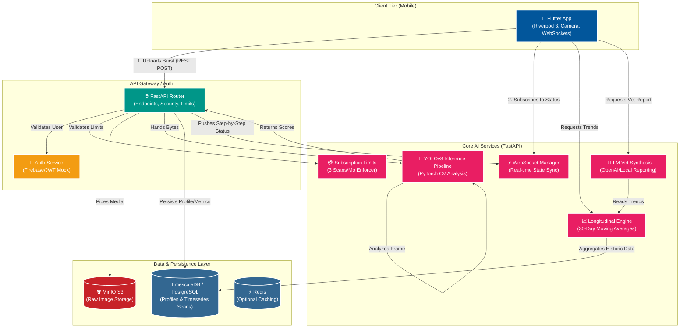

# PetVision AI: System Architecture

This document outlines the complete, end-to-end architecture of the PetVision AI application, from the Flutter mobile frontend down to the database persistence layer.

## High-Level System Architecture

### Component Breakdown

1. **📱 Flutter Mobile App**: The primary user interface. Handles local camera feed, buffers 10-second image bursts, caches offline scans for batch uploading, and visualizes analytical charts utilizing Riverpod for state management.
2. **🌐 FastAPI Backend**: The high-performance Python server. It coordinates API routing dynamically using clean dependency injection.
3. **🔐 Auth & Billing**: Protects the API. Assigns scans safely to specific user UUIDs and limits raw pipeline execution cleanly (e.g., maximum 3 free scans per month).
4. **🧠 YOLOv8 Computer Vision Pipeline**: The core intelligence. Loaded in Python via PyTorch, it evaluates raw bytes sequentially for body condition, eye health, dental plaque, and coat traits, computing numeric scores accurately.
5. **⚡ WebSocket Manager**: Because ML operations take time, the router streams exact inference phases ("Ingesting -> Processing -> Saved") cleanly back to Flutter instances asynchronously without blocking them.
6. **🐘 TimescaleDB**: A powerful PostgreSQL extension optimized purely for time-series data. It makes querying vast arrays of historical `PetScanResult` entries for the `Longitudinal Engine` hyper-efficient.
7. **🪣 MinIO S3**: S3-compatible object storage. Securely harbors the raw jpeg images locally, freeing the SQL database structurally to index URLs rather than massive blobs of byte data.
